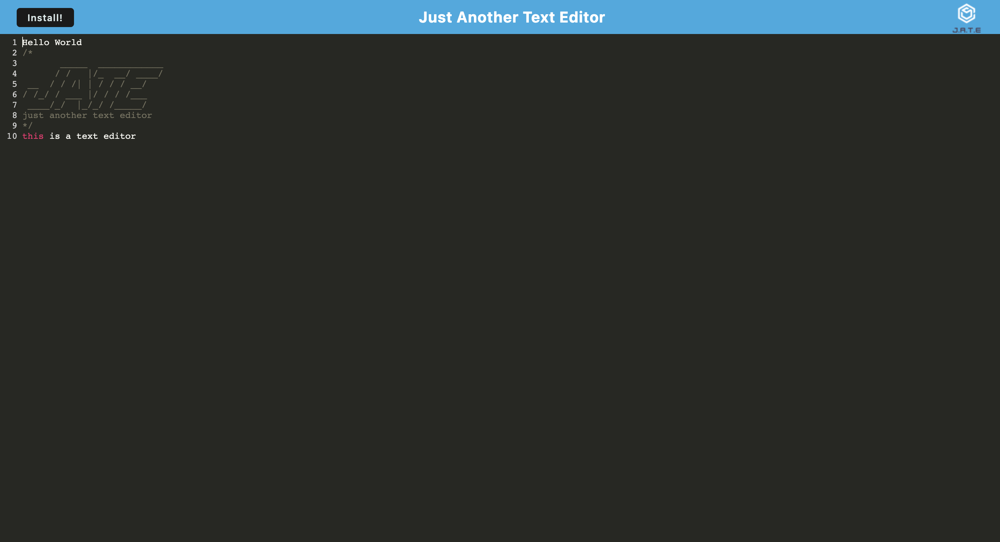

# Jate Text Editor App

## Licensing: MIT 

## Description
The app will be a single-page application that meets the PWA criteria. Additionally, it will feature a number of data persistence techniques that serve as redundancy in case one of the options is not supported by the browser. The application will also function offline.

## Table of Contents

-[Installation](#installation) -[Usage](#usage) -[Credits](#credits) -[License](#license)  
-[Tech used](#tech-used)

## Installation

To install, please follow the steps listed:
    1. Download the code using the install button on the deployed app
    2. After installation, in the integrated terminal on vs code, enter 'npm i' to install all of the dependencies we will need
    3. After all packages are installed, in the terminal, enter 'npm start' to initialize the server
     
    Deployed Heroku URL: https://text-editor-jate-app-1ccddd765a73.herokuapp.com/

## Usage

    - The user may use this app as a text editor alternate to their default editor
    - The user may use this text editor offline
    - The user may make any alterations to the code provided to fit their needs

## Tech used

- JavaScript
- Node.JS
- HTML
- CSS
- Webpack

## Credits

n/a

## Questions

Have any questions or concerns? Here is where you can reach me:

- Github: alugo0823
- Email: lugo.kse23@gmail.com

## Screenshot

